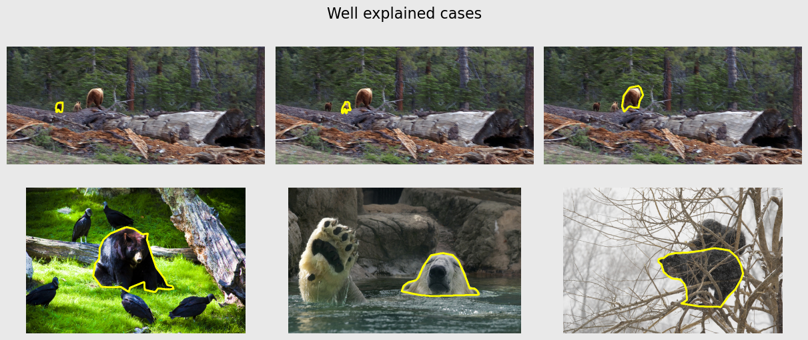

# UnSegQC

Code related to the paper:

*Unsupervised quality control of segmentations based on a smoothness and intensity probabilistic model*

by Benoît Audelan and Hervé Delingette. 

Link: https://doi.org/10.1016/j.media.2020.101895

# Installation

## GNU/Linux
Install conda:
```bash
wget https://repo.anaconda.com/miniconda/Miniconda3-latest-Linux-x86_64.sh  
bash Miniconda3-latest-Linux-x86_64.sh
```

Download this github repository and move into in:
```bash
git clone git://gitlab.inria.fr/baudelan/unsegqc
cd unsegqc
```

Install the customized python environment:
```bash
conda env create -f environment.yml
```

Activate the python environment:
```bash
conda activate UnSegQC
```

Install the UnSegQC package:
```bash
python setup.py install
```

An alternative to the last point is to install the package in "develop" mode.
Using this mode, all local modifications of source code will be considered in your Python interpreter (when restarted) without having to install the package again.
This is particularly useful when adding new features.
To install this package in develop mode, type the following command line:
```bash
python setup.py develop
```

## Windows
Download and install conda from: https://docs.conda.io/en/latest/miniconda.html

Download this github repository from: https://gitlab.inria.fr/baudelan/unsegqc

Open the Anaconda prompt and move into the github repository previously downloaded.

Deactivate the base environment:
`conda deactivate`

Install the customized python environment:
`conda env create -f environment.yml`

Activate the python environment:
`conda activate UnSegQC`

Install the ProMFusion package:
`python setup.py install`

An alternative to the last point is to install the package in "develop" mode.
Using this mode, all local modifications of source code will be considered in your Python interpreter (when restarted) without having to install the package again.
This is particularly useful when adding new features.
To install this package in develop mode, type the following command line:
`python setup.py develop`

# Usage

We give a use case example on 71 segmentations of bear images from the COCO dataset. The package pycocotools is used to process the dataset and needs to be installed:
```
pip install pycocotools
```
The COCO images and annotations of the val2017 dataset are available on the project website (https://cocodataset.org/#download).
- Download, unzip, and place the images in: coco/val2017/
- Download and place the annotations in: coco/annotations/

Each segmentation is fed to the model which outputs a novel probabilistic segmentation. The following histogram shows the distribution of adequacies between inputs and outputs within the whole dataset:


Segmentations on the left tail with small ASE are explained by the model. On the contrary, segmentations on the right tail exhibit a different behavior than the majority of the distribution and are thus classified as challenging.
 
We show bellow the 10 segmentations with the smallest ASE taken from the left tail (explained segmentations) and the 10 segmentations with the largest ASE taken from the right tail (unexplained segmentations).




# Licence

Copyright (C) 2020  Benoît Audelan

This file is part of UnSegQC.

UnSegQC is free software: you can redistribute it and/or modify
it under the terms of the GNU General Public License as published by
the Free Software Foundation, either version 3 of the License, or
(at your option) any later version.

UnSegQC is distributed in the hope that it will be useful,
but WITHOUT ANY WARRANTY; without even the implied warranty of
MERCHANTABILITY or FITNESS FOR A PARTICULAR PURPOSE.  See the
GNU General Public License for more details.

You should have received a copy of the GNU General Public License
along with UnSegQC.  If not, see <https://www.gnu.org/licenses/>.
